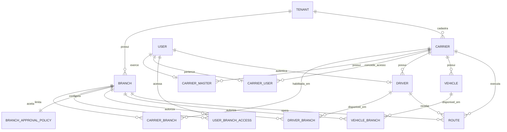

# Arquitetura de acessos, transportadoras e filiais

Este documento é a referência reutilizável para sistemas com administração central, filiais e prestadores compartilhados. A imagem original está preservada em [`assets/arquitetura-acessos-filiais.png`](assets/arquitetura-acessos-filiais.png).

## Decisões de domínio

- A Adimax é a administração central. Colaboradores recebem filiais explícitas ou a capacidade especial `todas as filiais, inclusive futuras`.
- A transportadora tem um cadastro único por CNPJ e se relaciona com N filiais por `carrier_branches`.
- Um master pertence à transportadora, nunca à filial. Existem no máximo três masters ativos por transportadora.
- Motoristas e veículos pertencem à transportadora e sua disponibilidade é decidida separadamente por filial.
- `active/blocked` representa a situação cadastral global. `approval_status` representa somente a decisão daquela filial. Um estado nunca reativa o outro.
- O login do motorista (`users`) e seu cadastro operacional (`drivers`) continuam separados e ligados por ID.
- O motorista autenticado visualiza somente rotas cujo `driver_id` corresponde ao cadastro ligado ao seu `user_id`; pertencer a uma filial não concede acesso a rotas.
- Criar uma filial não propaga automaticamente transportadoras, motoristas, veículos ou colaboradores.
- Alterar uma política de aprovação não interrompe viagens em andamento.

## Modelo



## Regra de elegibilidade

Um motorista ou veículo pode ser escalado em uma filial somente quando todas as condições forem verdadeiras:

```text
cadastro ativo
AND não bloqueado
AND transportadora ativa na filial
AND disponibilidade ativa na filial
AND (aprovação não exigida OR status = approved)
```

Quando a aprovação é ligada, `new_only` afeta apenas novos vínculos; `review_existing` coloca os vínculos ativos existentes como `pending`. Desligar a exigência não altera `active`, `blocked` nem cadastros rejeitados.

## Visibilidade e troca da transportadora da rota

Cada rota possui `branch_id` e `carrier_id`. Usuários Adimax seguem seu escopo de filial; usuários de transportadora exigem simultaneamente transportadora correspondente, filial habilitada e filial presente no acesso do usuário. O motorista continua sendo filtrado exclusivamente pelo `driver_id` atribuído.

Na importação, cada rota informa obrigatoriamente `ID TRANSPORTADORA` e `TRANSPORTADORA`. O ID é a identidade única e a fonte de verdade para o vínculo e para a distribuição da rota; o nome é uma conferência legível e deve coincidir com o cadastro apontado pelo ID. O modelo baixado contém uma aba `Transportadoras` com os pares de ID e nome habilitados para a filial. ID inexistente/inativo, nome divergente ou transportadora não habilitada na filial gera `carrier_assignment_status = pending_carrier` e uma justificativa em `carrier_assignment_issue`; a rota fica disponível para correção Adimax, mas invisível às transportadoras.

A troca posterior usa uma única transação, exclusiva do administrador global: valida a nova transportadora, cria `route_carrier_changes`, atualiza a rota e remove motorista/veículo. O log imutável mantém filial, transportadoras anterior/nova, responsável, momento, motivo, atribuições anteriores e status. Entregas, ocorrências, evidências e eventos históricos permanecem ligados à rota; apenas seu acesso passa a seguir a transportadora atual. A auditoria interna não é exposta à transportadora.

## Responsabilidades

| Papel | Escopo |
|---|---|
| Administrador global Adimax | Todas as filiais, vínculos, políticas e usuários Adimax |
| Administrador de filial | Sua lista explícita de filiais, convites, acessos locais e aprovações |
| Master da transportadora | Sua transportadora e somente as filiais liberadas; nomeia até mais dois masters |
| Usuário da transportadora | Funções do perfil dentro da empresa e filiais autorizadas |
| Motorista | Rotas atribuídas ao seu cadastro operacional |

## Endpoints do protótipo local

- `GET /api/access-model/branches/{id}`: visão da filial.
- `PUT /api/access-model/branches/{id}/approval-policy`: política de aprovação.
- `PUT /api/access-model/carriers/{carrier_id}/branches/{branch_id}`: libera transportadora.
- `POST /api/access-model/carriers/{carrier_id}/masters/{user_id}`: nomeia master e aplica o limite global de três.
- `PUT /api/access-model/drivers/{id}/branches/{branch_id}` e equivalente de veículos: disponibilidade.
- `POST /api/access-model/{drivers|vehicles}/{id}/branches/{branch_id}/review`: aprova ou reprova.

## Evolução segura

Antes de levar este modelo a produção: auditar CNPJs duplicados, vínculos implícitos existentes, usuários sem transportadora e viagens abertas; executar migração transacional; não armazenar senhas temporárias; e verificar isolamento de tenant, limite de masters e visibilidade por atribuição.

## Aviso ao codex — revisão de 2026-09-18

Revisão cruzada do que estava implementado nesta branch. Encontrado e corrigido:

1. **`UserBranchAccess`/`UserAccessPolicy` não tinham efeito real.** As tabelas existiam, mas `operational_scope`/`branch_scope_filter`/`require_branch_access` em [`app/core/permissions.py`](../apps/api/app/core/permissions.py) só liam `user.branch_id` (um valor único). Um colaborador Adimax com múltiplas filiais explícitas, ou com a política "todas as filiais, inclusive futuras", não tinha esse acesso refletido em nenhum endpoint real (rotas, tracking, motoristas). Corrigido: `user_branch_ids()` e `has_all_branches_policy()` centralizam a leitura dessas tabelas e são usados por `branch_scope_filter`, `require_branch_access` e `require_same_branch`. `has_all_branches_policy` resolve para `AccessScope.TENANT` (mesmo comportamento de "todas as filiais da empresa, inclusive futuras" que o tenant scope já dava).
2. **Duplicação de lógica de escopo em `routes/router.py`.** `_carrier_branch_ids()` reimplementava a interseção "filiais da transportadora ∩ filiais do usuário" localmente, ignorando `has_all_environment_access`/`has_all_branches_policy`. Um admin global ou colaborador com a política "todas as filiais" que também fosse `CarrierUser` seria incorretamente restringido às filiais explícitas. Corrigido para reaproveitar `user_branch_ids`/`has_all_environment_access`/`has_all_branches_policy` de `core.permissions` — mesma fonte de verdade usada em todo o resto do sistema.
3. **Corrida (TOCTOU) no limite de 3 masters.** `add_master` (`access_model/router.py`) contava masters ativos e só depois inseria, sem lock — duas requisições simultâneas podiam ultrapassar o limite. Corrigido com `SELECT ... FOR UPDATE` na linha do `Carrier` antes da contagem, serializando concorrentes na mesma transportadora.
4. **Validação de CPF/CNPJ divergente entre módulos.** `access_model/router.py::enable_carrier_branch` exigia sempre 14 dígitos (CNPJ), rejeitando transportadoras `pessoa_fisica` (CPF) que `carriers/router.py` permite cadastrar normalmente — uma transportadora pessoa física válida nunca conseguiria ser vinculada a uma filial. A checagem de duplicidade também comparava strings brutas (sem normalizar pontuação), podendo deixar passar duplicatas com formatação diferente. Corrigido: `app/services/documents.py` agora é a fonte única (`normalize_document`, `is_valid_document`), usada tanto por `carriers/router.py` quanto por `access_model/router.py`.

Suíte completa (`pytest`, 47 testes) roda sem regressões após essas mudanças, incluindo os 8 testes específicos de `test_access_model.py`, `test_route_carrier_access.py` e `test_route_assignment_multibranch_driver.py`.

Pendências que ainda valem revisão futura: `CarrierMaster` não tem constraint de banco para o limite de 3 (só o lock de aplicação acima); e não há endpoint no `access_model` para o admin global gerenciar `UserBranchAccess`/`UserAccessPolicy` diretamente (hoje só é possível escrever essas tabelas via acesso direto ao banco/seed).
