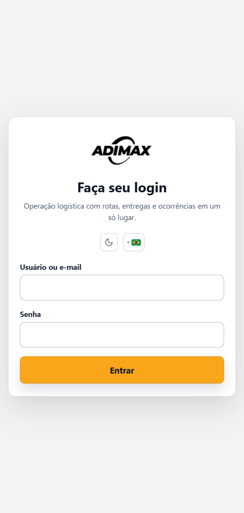
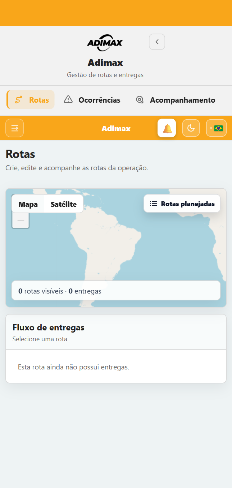
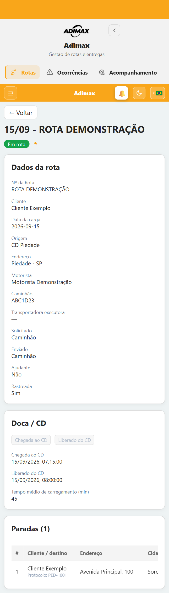
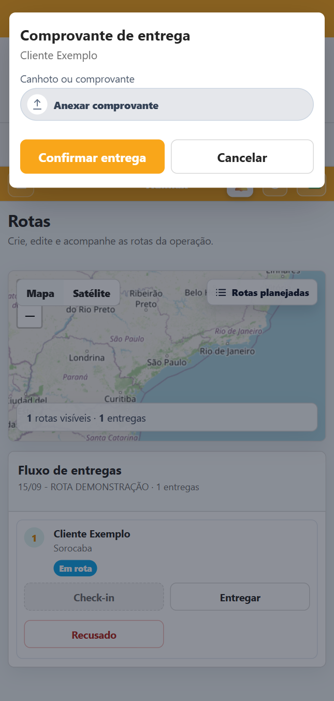
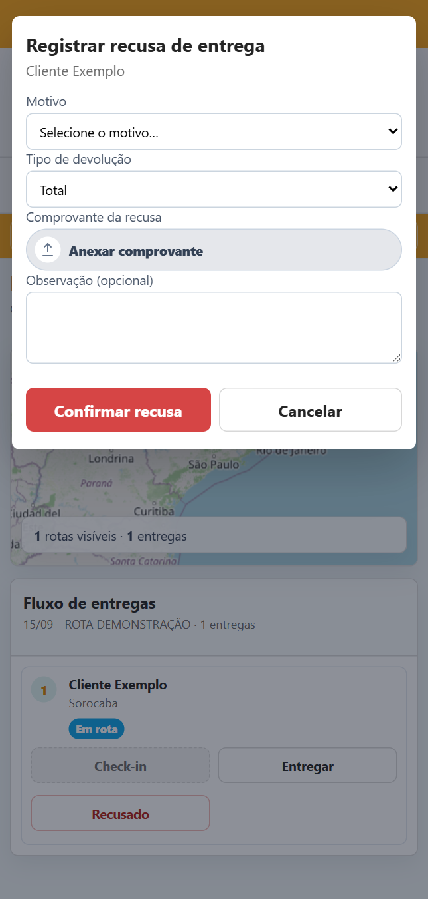
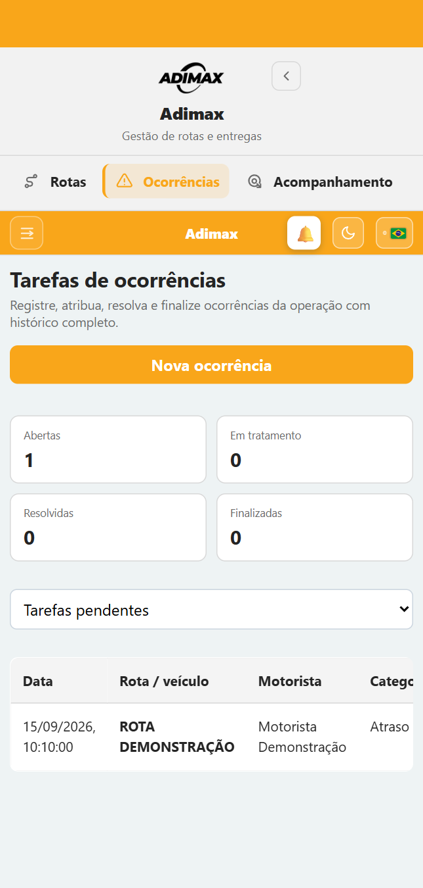
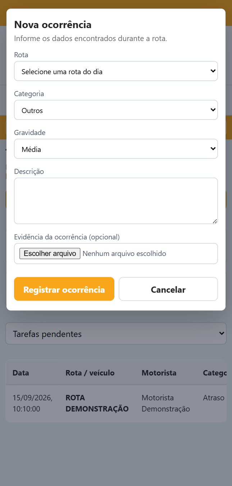

# Manual do Motorista — Aplicativo Adimax Android

**Tela de login, rotas e ocorrências**  
Versão do manual: 1.2 — 18/09/2026

## 1. Tela de login

A tela de login é a porta de entrada do aplicativo.

### Como entrar

1. Abra o aplicativo **Adimax Motorista**.
2. No campo **Usuário ou e-mail**, digite o acesso fornecido pela empresa.
3. No campo **Senha**, digite sua senha.
4. Toque em **Entrar**.

No primeiro acesso, o aplicativo pode solicitar a criação de uma nova senha. Digite a nova senha, confirme-a e salve. Depois disso, use essa senha nos próximos acessos.

### Botões da tela

| Item | Função |
|---|---|
| Usuário ou e-mail | identifica o motorista que está entrando |
| Senha | recebe a senha pessoal de acesso |
| Entrar | valida os dados e abre as rotas do motorista |
| Lua/sol | alterna entre tema claro e escuro |
| Bandeira | seleciona o idioma disponível |

Se o acesso não funcionar, confira se usuário e senha foram digitados corretamente. Para senha esquecida, bloqueada ou expirada, solicite a redefinição ao responsável pela operação.

## 2. Tela de rotas

Depois do login, o motorista é direcionado para **Rotas**. Essa tela mostra apenas as rotas atribuídas ao cadastro do motorista conectado.

*Exemplo demonstrativo da tela de rotas, com dados fictícios.*

### 2.1 Lista de rotas

Cada rota pode apresentar:

- número ou código da rota;
- data da operação;
- origem;
- veículo atribuído;
- situação atual;
- clientes e quantidade de paradas.

### 2.2 Filtros

| Filtro | O que mostra |
|---|---|
| Abertas | rotas planejadas, liberadas ou em andamento |
| Pendências anteriores | rotas de dias anteriores que ainda precisam ser concluídas |
| Fechadas | rotas finalizadas ou canceladas |
| Todas | todas as rotas permitidas ao motorista |

Para trabalhar em uma rota, toque nela e selecione **Abrir**.

### 2.3 Informações da rota

Ao abrir a rota, confira código e data, origem, endereço do CD, motorista, veículo, situação, sequência das paradas, cliente, endereço, cidade, pedido e horário previsto.

*A tela de detalhe reúne dados da carga, etapas do CD e paradas.*

Antes de iniciar, confirme se a rota e o veículo estão corretos. Se houver divergência, comunique a operação antes de registrar as etapas.

### 2.4 Chegada e liberação do CD

1. Ao chegar ao centro de distribuição, toque em **Chegada ao CD**.
2. Aguarde o carregamento e a autorização da operação.
3. Quando estiver liberado para viajar, toque em **Liberado do CD**.

O botão **Liberado do CD** também registra a saída do veículo e altera a rota para **Em rota**. Se um botão estiver desabilitado, a etapa anterior pode não ter sido concluída ou a rota pode já estar encerrada.

### 2.5 Atender uma parada

As paradas devem ser atendidas na ordem apresentada.

1. Confira o cliente, endereço e pedido.
2. Ao chegar ao local, toque em **Check-in**.
3. Faça a entrega.
4. Toque em **Entregar**.
5. Fotografe o canhoto/comprovante ou escolha um arquivo.
6. Confira se o documento está legível.
7. Toque em **Confirmar entrega**.

Depois da confirmação, a parada muda para **Entregue** e recebe o horário da conclusão.

### 2.6 Comprovante de entrega

Ao tocar em **Entregar**, o aplicativo permite abrir a câmera, escolher uma imagem armazenada no aparelho ou escolher um arquivo PDF.

Enquadre o documento inteiro, evite sombra e reflexo, confirme se assinatura, carimbo, data e número estão legíveis e aguarde o envio terminar antes de sair da tela.

### 2.7 Entrega recusada ou devolução

1. Toque em **Recusado**.
2. Selecione o motivo da recusa.
3. Escolha devolução **Total** ou **Parcial**.
4. Se for parcial, informe a quantidade devolvida.
5. Anexe uma foto ou documento que comprove a ocorrência.
6. Escreva uma observação, quando necessário.
7. Toque em **Confirmar recusa**.

Ao retornar ao CD, abra novamente a parada e toque em **Devolução entregue no CD**. Anexe o comprovante de recebimento da mercadoria pelo armazém e salve.

### 2.8 Situações da parada

| Situação | Significado |
|---|---|
| Pendente | atendimento ainda não iniciado |
| Em rota | check-in ou deslocamento da parada em andamento |
| Entregue | entrega concluída com comprovante |
| Recusado/Falha | entrega não concluída e motivo registrado |
| Devolvido | mercadoria retornada total ou parcialmente |

### 2.9 Fechar a rota

1. Confira se nenhuma parada permanece pendente.
2. Confira os comprovantes de entrega.
3. Em caso de devolução, confirme o comprovante da entrega no CD.
4. Toque em **Fechar rota**.
5. Se a tela solicitar documentos pendentes, anexe cada comprovante.
6. Toque em **Enviar e fechar rota**.

Após o fechamento, os botões de check-in, entrega e recusa ficam bloqueados. Para corrigir uma rota encerrada, entre em contato com a operação.

## 3. Tela de ocorrências

A tela **Ocorrências** serve para comunicar problemas encontrados durante a operação e acompanhar o tratamento realizado pela equipe.

*Exemplo demonstrativo da lista, com rota e motorista fictícios.*

### 3.1 Lista de ocorrências

A tela apresenta quantidade de ocorrências abertas, em tratamento, resolvidas e finalizadas, além de rota, categoria, gravidade, descrição, situação e responsável.

Os filtros permitem visualizar tarefas pendentes, todas as ocorrências ou apenas uma situação específica.

### 3.2 Registrar uma ocorrência

1. Toque em **Nova ocorrência**.
2. Selecione uma rota disponível do dia.
3. Escolha a **Categoria**.
4. Escolha a **Gravidade**.
5. Descreva claramente o que aconteceu.
6. Anexe uma foto ou documento, quando necessário.
7. Toque em **Registrar ocorrência**.

### 3.3 Níveis de gravidade

| Gravidade | Quando utilizar |
|---|---|
| Baixa | situação sem impacto imediato na entrega |
| Média | problema que precisa ser acompanhado pela operação |
| Alta | problema com impacto importante na rota ou entrega |
| Crítica | situação urgente, de segurança ou que interrompe a operação |

Em caso de risco à integridade física, pare em local seguro e acione imediatamente os canais de emergência e a operação. O registro no aplicativo não substitui uma ligação urgente.

### 3.4 Como escrever uma boa descrição

Informe o que aconteceu, local e horário, cliente ou parada envolvida, impacto na entrega e a ação que já foi tomada.

Exemplo: **“Cliente fechado às 14:35. Portaria sem resposta. Operação avisada e foto da fachada anexada.”**

### 3.5 Editar ou excluir

Enquanto a ocorrência estiver **Aberta**, o motorista pode tocar em **Editar** para corrigir os dados ou em **Excluir** para remover um registro feito por engano. Depois que a equipe assumir o tratamento, as alterações passam a ser controladas pela operação.

### 3.6 Acompanhar o tratamento

As situações seguem normalmente:

**Aberta → Em tratamento → Resolvida → Finalizada.**

A ocorrência também pode ser cancelada quando registrada por engano ou quando deixar de ser aplicável. O histórico pode mostrar data, etapa, responsável, solução e observações da equipe.

## 4. Trabalhar sem internet

O aplicativo permite continuar a rota quando o sinal de internet desaparecer. Um aviso no alto da tela mostra **Trabalhando sem internet** e a quantidade de ações que aguardam sincronização.

Podem ficar guardados no aparelho:

- chegada e liberação do CD;
- check-in de parada;
- entrega ou recusa;
- fotos, PDFs e comprovantes;
- comprovante de devolução no CD;
- posição de rastreamento.

### Passo a passo

1. Continue usando os botões normalmente.
2. Confira se a tela avançou para a próxima etapa.
3. Mantenha o aplicativo instalado e não limpe seus dados.
4. Quando houver rede, deixe o aplicativo aberto por alguns instantes.
5. Aguarde o contador chegar a zero; o sistema atualizará a rota automaticamente.

As ações são enviadas na ordem em que foram feitas e possuem proteção contra duplicidade. Fechar o aplicativo ou reiniciar o aparelho não apaga a fila. Porém, sair da conta, limpar os dados ou desinstalar o aplicativo pode impedir a recuperação local; evite essas ações até terminar a sincronização.

Se o aviso indicar falha, toque nele para tentar novamente. Persistindo o problema, informe à operação o código da rota, a parada e a ação pendente.

## 5. Resumo rápido

### Login

**Abrir aplicativo → informar usuário → informar senha → Entrar.**

### Rota

**Abrir rota → Chegada ao CD → Liberado do CD → Check-in → Entregar ou Recusado → anexar comprovantes → Fechar rota.**

### Ocorrência

**Ocorrências → Nova ocorrência → selecionar rota → categoria → gravidade → descrição/evidência → Registrar ocorrência.**
