# Manual do Usuário — Adimax Log

**Gestão de rotas, entregas, ocorrências e evidências**  
Versão do manual: 2.0 — 18/09/2026

> Este manual descreve a versão atual do sistema. A disponibilidade de telas e botões depende do perfil, da filial e dos serviços habilitados para a empresa.

## 1. Visão geral

O Adimax Log acompanha a operação desde o planejamento da carga até o encerramento da rota. O fluxo principal é:

**criar ou importar a rota → atribuir motorista e veículo → calcular/validar o trajeto → registrar chegada ao CD → liberar a carga → sair do CD → atender as paradas → tratar devoluções → fechar a rota.**

Cada ação operacional relevante gera data e hora e compõe o histórico auditável. O sistema também controla quem pode enxergar e alterar cada registro.

## 2. Acesso e navegação

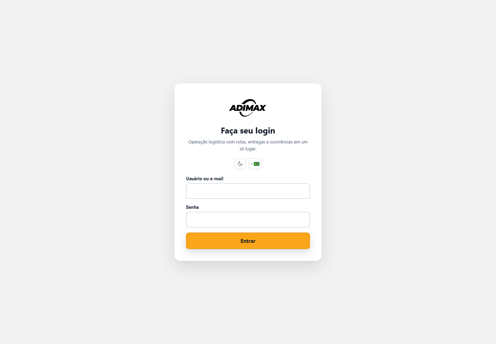

### 2.1 Entrar

1. Abra o endereço fornecido pela empresa.
2. Informe **Usuário ou e-mail** e **Senha**.
3. Selecione **Entrar**.
4. No primeiro acesso, informe e confirme uma nova senha. A senha temporária deixa de valer após a troca.

Na tela de login também é possível alternar tema claro/escuro e idioma português do Brasil/Portugal.

### 2.2 Estrutura da tela

- **Menu lateral ou superior:** abre os módulos permitidos ao perfil. O botão de posição alterna entre os dois formatos.
- **Sino:** reúne alertas críticos, de atenção, informativos e notificações. Um item abre diretamente o registro relacionado. **Limpar notificações** marca avisos como vistos.
- **Lua/sol:** alterna o tema.
- **Bandeira:** alterna o idioma.
- **Nome e perfil:** identifica o usuário ativo.
- **Sair:** encerra a sessão.

As listas operacionais se atualizam periodicamente. Filtros e formulários em edição são preservados sempre que possível.

## 3. Perfis e alcance dos dados

| Perfil | Alcance usual | Principais atividades |
|---|---|---|
| Administrador global | Todas as empresas | Configuração completa, perfis e correções administrativas |
| Gestor Brasil / gerente | Empresa | Gestão operacional, cadastros, usuários e relatórios |
| Torre de controle | Empresa | Monitoramento, roteirização e tratamento de ocorrências |
| Operador logístico | Filial, salvo permissão ampliada | Rotas, cadastros e operação diária |
| Auditor | Empresa | Painel, galeria, relatórios e auditoria |
| Motorista | Somente rotas atribuídas | Executar rota, anexar evidências e informar ocorrências |
| Cliente | Somente paradas vinculadas | Consultar rotas e acompanhamento permitido |

O nome do perfil define os módulos; o escopo define quais registros aparecem. A ausência de um botão normalmente indica falta de permissão, serviço desabilitado ou etapa operacional ainda não liberada.

### 3.1 Filiais, transportadoras e acessos compartilhados

- A Adimax possui administração global e visão consolidada das filiais.
- Salto e Barueri são as filiais iniciais; o administrador global pode incluir novas unidades.
- A transportadora tem cadastro único por CNPJ e pode ser habilitada em uma ou várias filiais.
- Cada transportadora pode manter no máximo três masters ativos, independentemente do número de filiais.
- O primeiro master recebe o convite da Adimax e pode nomear até dois outros masters.
- Masters administram usuários, motoristas e veículos somente dentro da própria transportadora e das filiais liberadas.
- Motoristas e veículos têm cadastro único na transportadora e disponibilidade configurada por filial.
- Um colaborador Adimax recebe filiais específicas ou a política **Todas as filiais, inclusive futuras**.

Quando uma transportadora já cadastrada começa a atender outra filial, crie somente o novo vínculo. Não duplique a empresa, seus masters, motoristas ou veículos.

### 3.2 Aprovação opcional por filial

A exigência de aprovação pode ser ativada separadamente para motoristas e veículos em cada filial. Com a regra desligada, um cadastro completo, ativo e disponibilizado fica operacional automaticamente. Com a regra ligada, novos cadastros ou vínculos ficam pendentes até aprovação de um usuário Adimax autorizado.

Os estados são independentes: **ativo/inativo** informa a situação cadastral; **pendente/aprovado/reprovado** informa a aprovação. Desligar a exigência não reativa um cadastro bloqueado. Ao ativar a regra, escolha entre aplicar somente aos novos vínculos ou revisar também os existentes, sem interromper viagens em andamento.

## 4. Painel

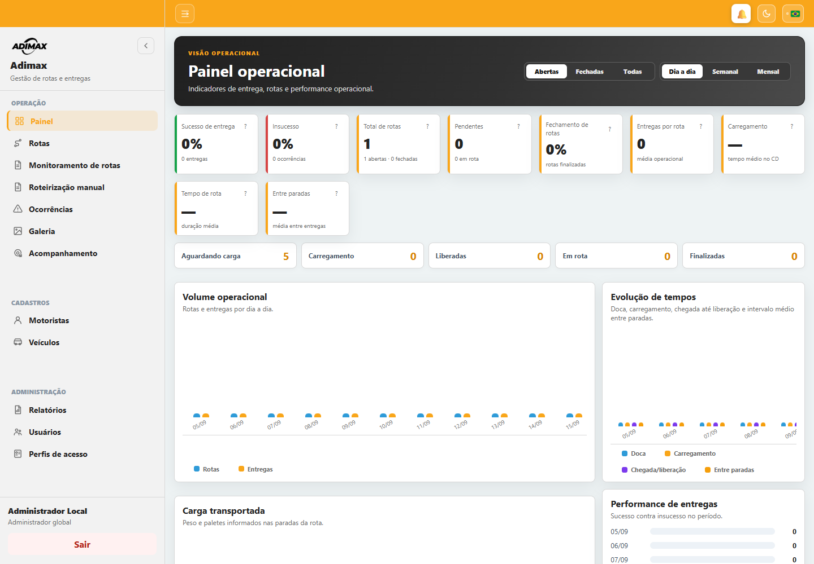

O **Painel** resume a operação. Escolha o período, a referência de semana quando exibida e a situação **Abertas**, **Fechadas** ou **Todas**.

Principais indicadores:

- rotas totais, abertas e fechadas;
- entregas totais, pendentes, em rota, entregues e sem sucesso;
- taxas de sucesso, insucesso e fechamento;
- média de entregas por rota;
- peso e paletes totais;
- rotas aguardando carregamento, em carregamento, liberadas, em rota e finalizadas;
- tempo médio de doca, carregamento, chegada até liberação, entre paradas e de rota;
- entregas atrasadas;
- gráficos de volume, status, carga, tempos e motivos de insucesso.

O botão **?** de um cartão explica o indicador. Os filtros afetam apenas os dados do período e da situação selecionados.

### 4.1 Cálculos do Painel

| Indicador | Regra aplicada |
|---|---|
| Entregas totais | quantidade de paradas das rotas filtradas |
| Sucessos | paradas com situação `entregue` |
| Insucessos | paradas com situação `falha` ou `devolvido` |
| Taxa de sucesso | sucessos ÷ (sucessos + insucessos) × 100 |
| Taxa de insucesso | insucessos ÷ (sucessos + insucessos) × 100 |
| Taxa de fechamento | rotas finalizadas ÷ rotas do filtro × 100 |
| Média de entregas por rota | total de paradas ÷ total de rotas |
| Peso total | soma do peso em kg de todas as paradas |
| Paletes totais | soma dos paletes de todas as paradas |
| Tempo de carregamento | fim do carregamento − início do carregamento |
| Chegada até liberação | liberação do operador − chegada ao CD |
| Tempo de rota | encerramento − saída efetiva do CD, somente em rotas finalizadas |
| Tempo entre paradas | diferença entre o encerramento de uma parada e o da parada seguinte |
| Entrega atrasada | parada pendente/em rota cuja data prevista já passou |

As médias ignoram registros sem os dois horários necessários e resultados negativos. Tempos são exibidos em minutos e arredondados para uma casa decimal.

## 5. Rotas

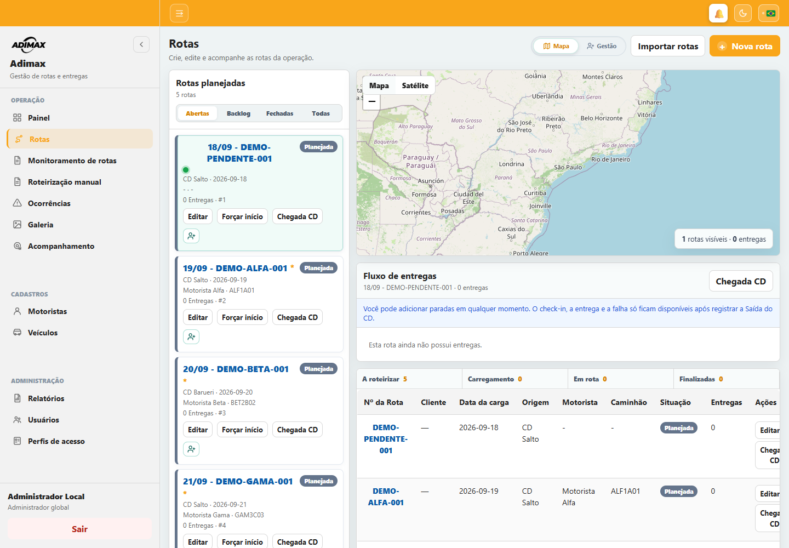

Esta é a tela central da operação. Ela possui as visões **Mapa** e **Gestão**, busca e filtros de rotas abertas, pendências anteriores, fechadas ou todas.

### 5.1 Situações

| Rota | Significado |
|---|---|
| Planejada | criada, ainda sem início no CD |
| Em carregamento | chegada ao CD registrada |
| Liberada | operador liberou a carga |
| Em rota | veículo saiu do CD |
| Finalizada | todas as etapas foram encerradas |
| Cancelada | rota cancelada por usuário autorizado |

| Parada | Significado |
|---|---|
| Pendente | ainda não iniciada |
| Em rota | check-in registrado |
| Entregue | entrega confirmada com comprovante |
| Recusado/Falha | atendimento sem sucesso, com motivo e evidência |
| Devolvido | mercadoria retornou total ou parcialmente |

### 5.2 Criar uma rota

1. Selecione **Nova rota**.
2. Informe código/número, data, origem, endereço, motorista e veículo conforme disponível.
3. Adicione as paradas com sequência, cliente, endereço, cidade, data/hora limite, peso, paletes e pedido.
4. Salve.

Motorista e veículo podem ser atribuídos depois. Cadastros bloqueados ou inativos não podem receber novas atribuições.

### 5.3 Importar rotas

1. Selecione **Importar rotas** ou use a área de importação do Monitoramento.
2. Baixe o modelo quando a tela oferecer essa opção.
3. Preencha sem alterar os cabeçalhos obrigatórios.
4. Escolha o arquivo e confirme a importação.
5. Confira o resumo de criadas, atualizadas, ignoradas e linhas com erro.

Cada linha deve identificar a transportadora por **ID único** e **nome**. O ID controla a identidade sem depender de grafia; o nome fica disponível para conferência e distribuição da rota aos responsáveis. O sistema valida se:

1. a filial da rota existe;
2. a transportadora existe;
3. ID e nome representam a mesma transportadora;
4. a transportadora está habilitada para a filial.

Se a identificação estiver ausente, divergente ou sem vínculo com a filial, a linha permanece pendente para correção pela Adimax e não aparece para a transportadora.

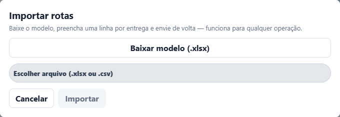

Importações futuras atualizam dados autorizados, mas preservam ações operacionais já realizadas. Rotas também podem vir de integração autorizada.

### 5.4 Mapa e fluxo de entregas

Ao selecionar uma rota, o mapa mostra origem, paradas e linha calculada. O painel **Fluxo de entregas** mostra a sequência e a situação. Cores e marcadores distinguem o andamento; um endereço inválido pode deixar a parada sem ponto no mapa.

### 5.5 Gestão e atribuições

Na visão **Gestão**, localize a rota e atribua motorista e veículo. O campo tem busca textual e só aceita uma opção válida da lista. O sistema valida filial, situação do cadastro e conflitos operacionais.

### 5.6 Detalhe da rota

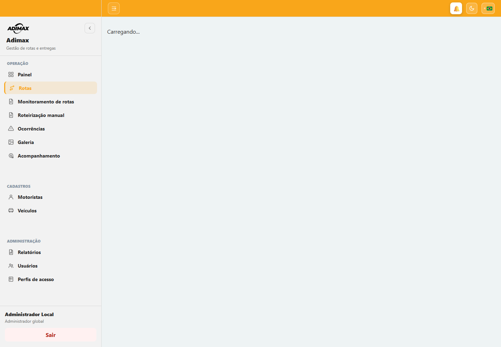

A tela **Abrir rota** reúne:

- dados gerais, origem, motorista, veículo solicitado/enviado, ajudante e indicação de rastreamento;
- dados importados e destino principal;
- etapas do CD;
- lista de paradas, operações, pedidos e comprovantes;
- edição administrativa para perfis autorizados.

#### Etapas do CD

Execute na ordem apresentada:

1. **Chegada ao CD**;
2. **Liberado do CD** — no fluxo atual, este comando também registra a saída do CD e muda a rota para **Em rota**.

As etapas internas antigas de entrada em doca/início/fim de carga e o comando separado de saída podem existir em registros históricos ou integrações, mas a tela atual da JMD mede chegada até liberação e registra liberação/saída juntas. Um botão desabilitado indica etapa anterior pendente, rota encerrada ou falta de permissão.

#### Paradas

- **Check-in:** registra a chegada ao cliente e coloca a parada em andamento.
- **Entregar:** exige foto ou arquivo do canhoto/comprovante e conclui a parada.
- **Recusado:** exige motivo, tipo de devolução (total/parcial), quantidade quando parcial e comprovante. Observação é opcional.
- **Devolução entregue no CD:** anexa a evidência do retorno físico ao armazém.
- **Editar/Remover:** altera dados de planejamento; disponível apenas a perfis autorizados.

O sistema permite concluir a parada atual mesmo se o check-in tiver sido esquecido, mas não permite pular uma parada anterior ainda aberta. Em várias notas do mesmo cliente/endereço, a progressão considera o grupo operacional.

#### Fechar e reabrir

**Fechar rota** só fica válido quando as paradas estiverem resolvidas. Se houver devolução, também é necessário anexar o comprovante de entrega no CD. O fechamento pode solicitar os comprovantes pendentes em lote. **Reabrir rota** é reservado a quem possui permissão de correção.

Administradores podem corrigir situação, limpar marcações, anexos ou eventos. Toda correção exige justificativa e fica registrada em auditoria.

### 5.7 Visibilidade e troca de transportadora

Toda rota possui uma filial responsável e uma transportadora executora. O administrador global vê todas; colaboradores Adimax veem as filiais autorizadas; usuários de transportadora veem somente as rotas da própria empresa nas filiais permitidas; motoristas veem somente as rotas atribuídas a eles.

Somente o **Administrador global Adimax** pode trocar a transportadora:

1. abra o detalhe da rota;
2. selecione **Alterar transportadora**;
3. escolha uma transportadora habilitada na filial;
4. informe o motivo obrigatório;
5. revise o aviso de impacto e confirme.

A transportadora anterior perde o acesso e a nova passa a enxergar os dados operacionais necessários. Motorista e veículo são desvinculados para nova atribuição. A alteração e o log são gravados juntos, registrando rota, filial, antes/depois, responsável, data/hora, motivo, atribuições anteriores e situação. O histórico operacional não é apagado nem transferido de autoria.

## 6. Monitoramento de rotas

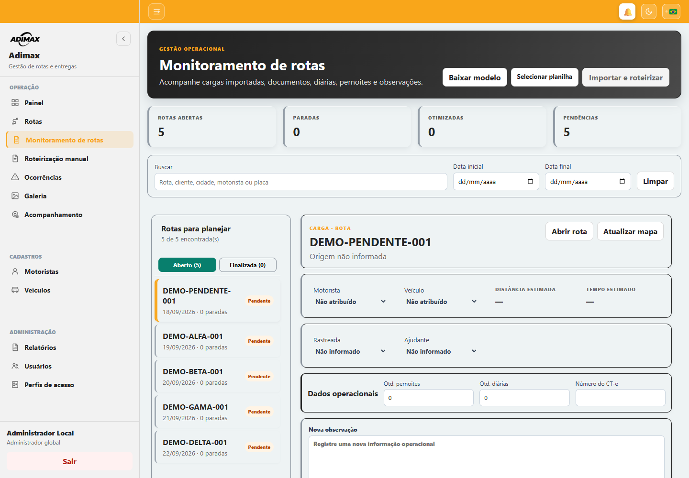

Use esta tela para preparar e supervisionar cargas:

1. filtre por código, origem e intervalo de datas;
2. selecione a carga na coluna lateral;
3. atribua motorista e veículo;
4. confira distância e duração estimadas;
5. marque se é rastreada e se terá ajudante;
6. informe pernoites, diárias, CT-e e documentos das paradas quando autorizado;
7. registre observações; cada inclusão recebe sequência, autor implícito e data/hora;
8. abra ou recolha o mapa.

Funções de roteirização:

- **Atualizar mapa:** recalcula localização, distância, duração e desenho viário sem alterar a ordem das paradas.
- **Otimizar sequência:** calcula uma sugestão; a ordem operacional original é preservada.
- **Aplicar sugestão:** transforma a sequência sugerida na sequência oficial.
- **Abrir rota:** vai ao fluxo operacional da carga.

### 6.1 Cálculo de distância e tempo

O roteirizador envia origem, destinos intermediários, destino final e categoria do veículo. A distância recebida em metros é dividida por 1.000 e arredondada para uma casa decimal. A duração recebida em milissegundos é dividida por 60.000 e arredondada para minutos.

Classificação automática do veículo:

- descrição com “carreta”, “articulado”, “bitrem” ou “rodotrem” → carreta/articulado;
- “truck”, “toco”, “baú” → caminhão grande;
- “3/4”, “VUC”, “ligeiro” → caminhão médio;
- demais descrições → carro.

Endereços idênticos consecutivos são agrupados para evitar trecho de distância zero. Se algum endereço não puder ser localizado, a estimativa completa é retirada até a correção.

## 7. Roteirização manual

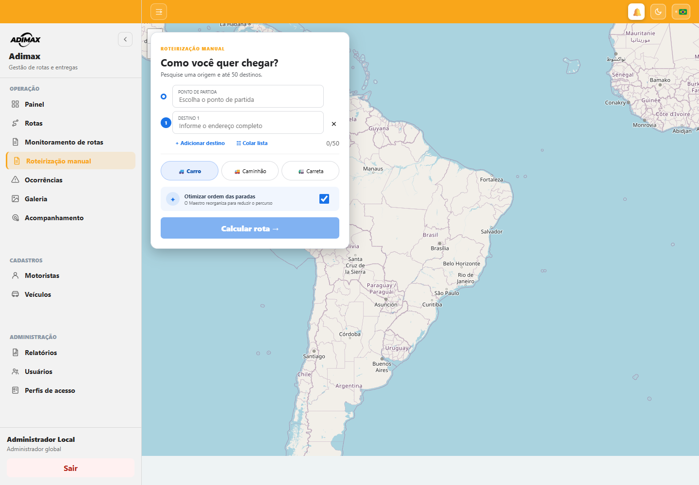

Serve para simular um trajeto sem criar uma rota operacional.

1. Informe o **Ponto de partida**.
2. Adicione até 50 destinos ou use **Colar lista** (um endereço por linha).
3. Escolha **Carro**, **Caminhão** ou **Carreta**.
4. Mantenha a otimização ligada para buscar a melhor ordem, quando desejado.
5. Selecione **Calcular rota**.

O resultado apresenta ordem calculada, distância, duração e mapa conforme resposta do serviço de roteirização.

## 8. Ocorrências

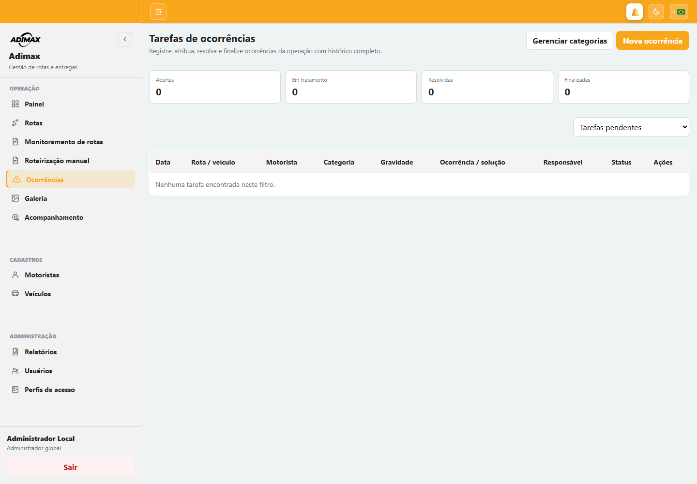

A tela controla problemas e tarefas operacionais com histórico completo.

### 8.1 Registrar

1. Selecione **Nova ocorrência**.
2. Escolha uma rota disponível do dia.
3. Informe categoria, gravidade (baixa, média, alta ou crítica) e descrição.
4. Anexe evidência pela câmera ou arquivos, se necessário.
5. Confirme em **Registrar ocorrência**.

Quando o aparelho permite, latitude e longitude acompanham o registro. O motorista pode editar ou excluir uma ocorrência própria enquanto ela estiver aberta.

### 8.2 Tratar

Gestores podem **Assumir**, mover entre aberta, em tratamento, resolvida, finalizada ou cancelada e registrar solução/notas. Resolver ou finalizar exige descrição do que foi feito. O histórico mostra data/hora, etapa, responsável e observação.

**Gerenciar categorias** permite criar, renomear, inativar e reativar opções sem apagar o histórico.

## 9. Galeria

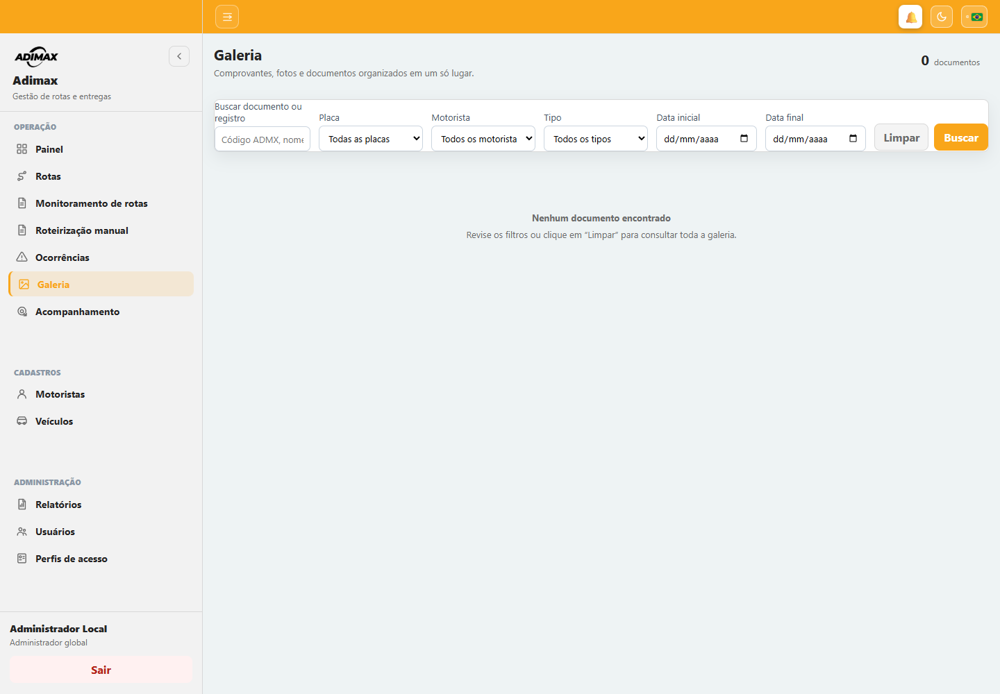

Centraliza comprovantes de entrega/devolução e outros anexos disponíveis na versão contratada.

Filtre por placa, motorista, tipo e intervalo de datas. **Abrir documento** baixa ou exibe o arquivo protegido. Administrador global pode excluir comprovante de entrega ou solicitar uma nova evidência ao motorista.

## 10. Acompanhamento GPS

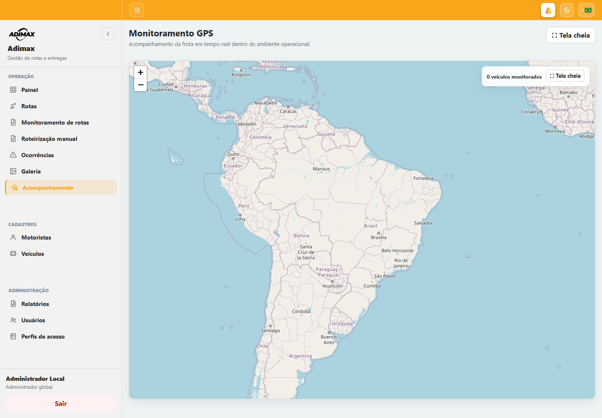

### Torre/gestão

O mapa mostra veículos monitorados, rota, motorista, placa, última velocidade e horário da posição. Use **Tela cheia** para a central de monitoramento. Dados antigos ou ausência de posição podem indicar aparelho sem sinal, permissão negada ou rota fora do estado ativo.

### Motorista

O GPS inicia automaticamente quando existe rota em andamento/rota do dia elegível e termina após o fechamento. A posição é enviada em torno de cada 120 segundos, com latitude, longitude, precisão, velocidade e data/hora. O Android mantém uma notificação “Rastreamento ativo durante sua rota” enquanto o serviço está em segundo plano.

## 11. Motoristas

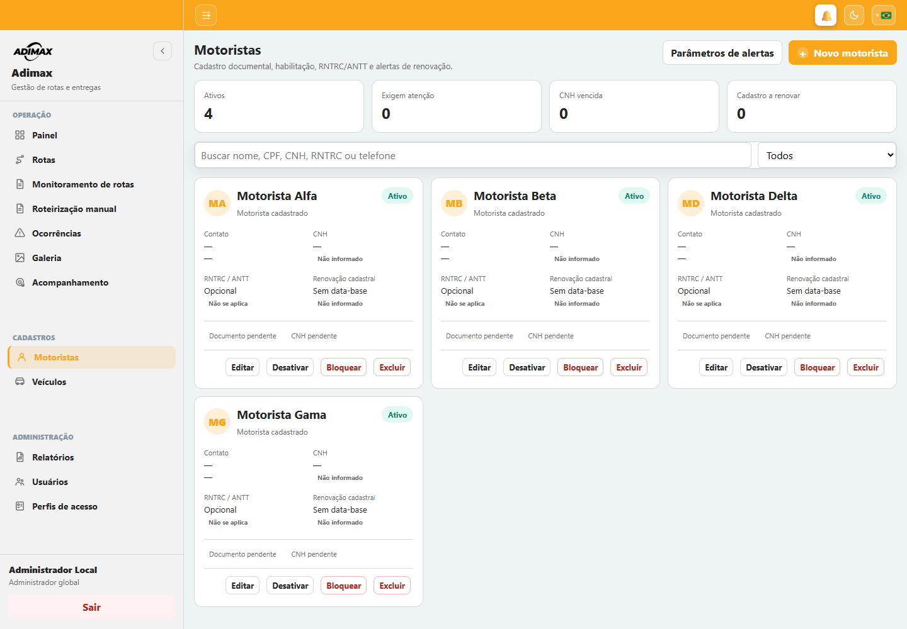

A tela mostra totais, cadastros com alertas e documentos próximos do vencimento.

Funções:

- pesquisar e filtrar ativos, inativos ou com alertas;
- cadastrar/editar dados pessoais e contato;
- selecionar filiais onde pode atuar;
- vincular o cadastro operacional a um usuário de acesso;
- informar CNH, categoria, validade, ANTT e demais registros;
- anexar documentos digitalizados;
- ativar, desativar, bloquear, desbloquear ou excluir quando não houver impedimento histórico;
- ajustar parâmetros de antecedência para alertas de validade.

**Desativar** retira o cadastro de novas operações; **Bloquear** representa impedimento explícito e exige motivo. Prefira essas ações a excluir registros com histórico.

## 12. Veículos

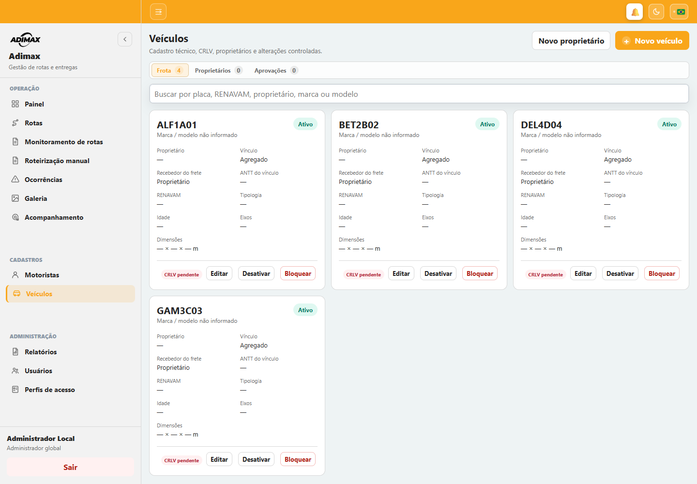

A tela possui três áreas:

- **Veículos:** placa, tipo, propriedade, documentos, situação e demais dados operacionais;
- **Proprietários:** pessoa física/jurídica responsável pelo veículo agregado;
- **Solicitações:** alterações que dependem de aprovação/rejeição.

Ao cadastrar, informe placa, tipo, filial, frota própria ou agregado, proprietário e quem recebe o frete. Para terceiro, selecione a transportadora. Anexe o CRLV quando solicitado. Situações e motivos seguem a mesma lógica de ativar/desativar/bloquear.

## 13. Relatórios

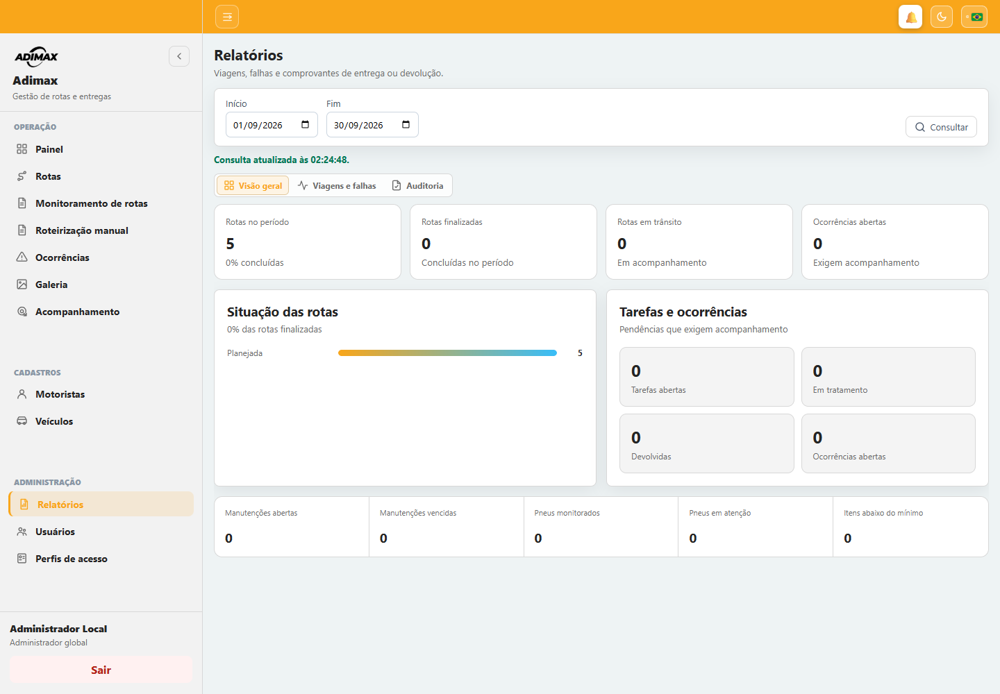

Defina **Início** e **Fim**, selecione **Consultar** e navegue pelas abas:

- **Visão geral:** indicadores resumidos e situação das rotas;
- **Viagens e falhas:** registros operacionais, falhas e comprovantes;
- **Auditoria:** ações de usuários, entidade alterada, detalhe, IP e data/hora.

Downloads disponíveis conforme perfil:

- viagens/rotas em XLSX;
- falhas em XLSX;
- comprovantes em ZIP;
- auditoria em XLSX.

No resumo gerencial, a taxa de conclusão é `rotas finalizadas ÷ total de rotas × 100`. Valores vazios produzem zero, evitando divisão inválida.

## 14. Usuários

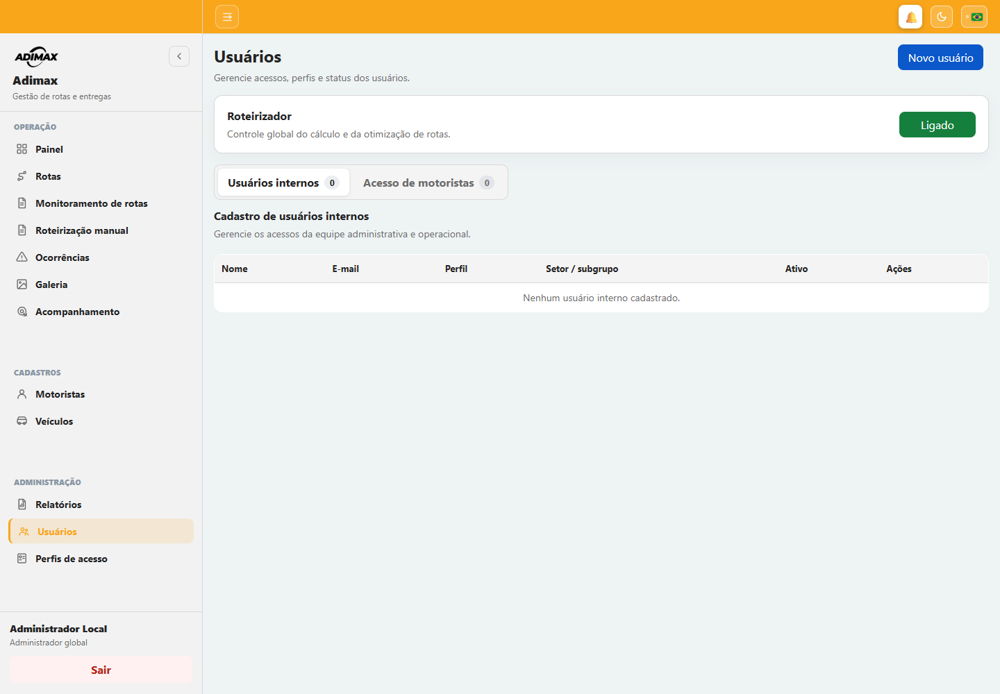

A tela separa **Equipe interna** e **Acessos de motoristas**.

Para criar acesso:

1. selecione **Novo usuário** ou **Novo acesso de motorista**;
2. para motorista, escolha primeiro o cadastro operacional;
3. informe nome, e-mail/usuário, perfil/setor e filial;
4. salve e copie a senha temporária exibida uma única vez;
5. entregue-a de forma segura. A troca será exigida no primeiro acesso.

Também é possível editar, ativar, desativar, bloquear/desbloquear e **Redefinir senha**. O usuário não pode bloquear a si próprio. O controle global do roteirizador pode ser ligado/desligado por administrador autorizado.

## 15. Perfis de acesso

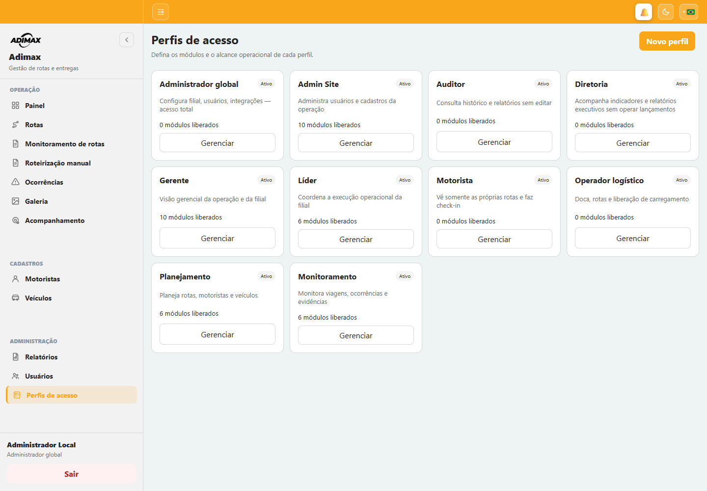

Disponível ao administrador global. **Novo perfil** cria código, nome, descrição e conjunto de módulos. **Gerenciar** altera permissões e situação. Um perfil inativo deixa de estar disponível para novas concessões, sem apagar o histórico.

Módulos atuais: Painel, Rotas, Monitoramento, Roteirização, Ocorrências, Galeria, Acompanhamento, Motoristas, Veículos, Relatórios e Usuários. Escopos de empresa/filial/atribuição continuam aplicados mesmo quando o módulo está liberado.

## 16. Operação sem internet no aplicativo

O aplicativo do motorista mantém o trabalho operacional quando o aparelho perde a conexão. As ações elegíveis são salvas em uma fila persistente no próprio aparelho, inclusive fotos e comprovantes.

### Como funciona

1. o motorista continua registrando chegada, liberação, check-in, entrega, recusa, devolução e posições de rastreamento;
2. a tela avança imediatamente e mostra o aviso **Trabalhando sem internet**;
3. o contador informa quantas ações aguardam envio;
4. ao recuperar a rede, o aplicativo envia tudo automaticamente, na ordem original;
5. ao terminar, a rota é recarregada com o estado confirmado pelo servidor.

Cada ação possui um identificador único. Se a rede cair depois de o servidor processar uma ação, a repetição é reconhecida e não gera dois check-ins ou duas entregas. A fila permanece mesmo se o aplicativo for fechado ou o aparelho reiniciado.

Não saia da conta, não limpe os dados do aplicativo e não desinstale o app enquanto houver ações pendentes. Se alguma sincronização falhar por regra de negócio, toque no aviso para tentar novamente após corrigir a condição ou procure a operação.

## 17. Boas práticas e solução rápida

- Confira motorista, veículo, origem e sequência antes de liberar a carga.
- Registre eventos no momento em que acontecem; os indicadores usam esses horários.
- Fotografe comprovantes legíveis, completos e com boa iluminação.
- Não compartilhe senhas e sempre encerre a sessão em aparelho compartilhado.
- Se um botão estiver desabilitado, verifique a etapa anterior, o status da rota e sua permissão.
- Se o mapa não calcular, complete endereço, cidade, estado e CEP e tente **Atualizar mapa**.
- Se o GPS não aparecer, confirme permissão de localização, GPS ligado, conexão e rota em andamento.
- Se uma devolução impedir o fechamento, anexe o comprovante de entrega no CD.
- Use correção administrativa apenas com justificativa clara; a ação é auditada.

Em caso de falha persistente, informe ao suporte: usuário, código da rota, horário, tela, ação executada e uma captura da mensagem — nunca envie a senha.
